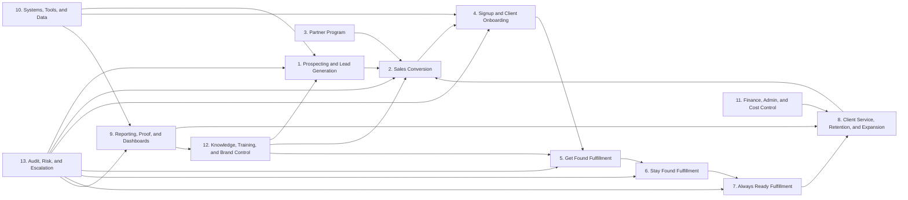
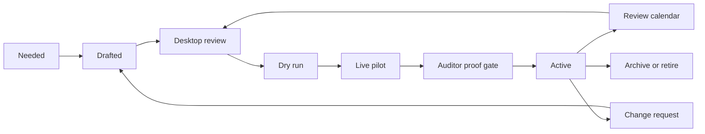
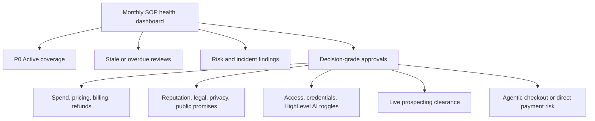

# GMF SOP Visual Map

Status: first visual draft
Owner: Coach
Last updated: 2026-05-27
Purpose: visual companion to `docs/GMF_SOP_MASTER_MAP.md` so Mike and operators can see how the SOP library fits together.

Governed by: `docs/sops/SOP-000-sop-creation-testing-governance-review.md`

## Recommended Visual Stack

GMF should use four views, not one giant diagram:

| View | Best Tool Now | Purpose |
|---|---|---|
| Owner/executive view | This Mermaid map, then optionally Miro/Lucidchart | See the whole business flow, bottlenecks, and risk zones |
| Working board | Monday | Track SOP writing, status, owner, blockers, review dates, and Active/P0 coverage |
| Source of truth | Repo docs / Obsidian-style markdown | Hold approved SOPs, version history, source docs, and operating rules |
| Execution proof | Monday/Supabase/app workflows, later Process Street/Trainual/Waybook if needed | Prove the SOP was followed with checklists, required fields, artifacts, and approvals |

Do not try to make one tool do all four jobs too early. The first win is clarity, not software sprawl.

## Master Business Flow

## Client Delivery Flow

```mermaid
flowchart LR
  Checkout["Payment or Mike-approved manual start"]
  Handoff["Sales-to-client handoff"]
  Hub["Client ID, folder, hub, magic link"]
  Access["GBP and needed access"]
  Baseline["Baseline visibility report"]
  Fixes["Get Found fixes"]
  Proof["Before/after proof"]
  Recurring["Stay Found recurring work"]
  Strategy["Always Ready strategy"]
  Recap["Monthly recap and client dashboard"]
  Renewal["Retention, renewal, or upgrade"]

  Checkout --> Handoff
  Handoff --> Hub
  Hub --> Access
  Access --> Baseline
  Baseline --> Fixes
  Fixes --> Proof
  Proof --> Recurring
  Recurring --> Strategy
  Strategy --> Recap
  Recap --> Renewal
  Renewal --> Recurring
```

## SOP Activation Flow

## Mike View

Mike should see a dashboard, not every working detail.

## Tool Notes

- Miro or FigJam is best for workshop-style messy discovery.
- Lucidchart or Visio is best for clean swimlanes, BPMN, and board-ready process diagrams.
- Draw.io/diagrams.net is the best low-cost diagramming fallback.
- Monday or ClickUp is best when the visual needs to become work assignments, status, automations, and owner follow-up.
- Scribe or Tango is best for turning screen-recorded software tasks into step-by-step visual guides.
- Process Street, Trainual, Waybook, SweetProcess, or Whale become relevant when GMF needs read acknowledgments, recurring checklists, training tracking, and proof that the SOP was followed.

Recommendation for GMF now: keep the visual map in docs, mirror the SOP backlog in Monday, and only consider a dedicated SOP platform after the first 25-40 P0/P1 SOPs are tested and Active.
